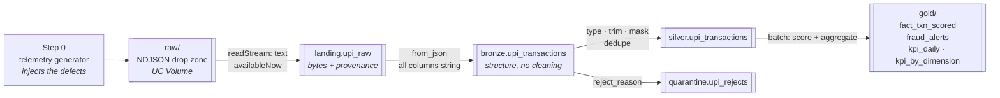

# Project Sentinel — Real-Time UPI Transaction & Fraud Detection Pipeline

A Medallion Architecture pipeline over simulated UPI payment telemetry: raw JSON
lands untransformed, is structured into Delta, cleansed and masked, then aggregated
into business KPIs and explainable fraud alerts.

**Stack** — PySpark 3.5 · Delta Lake 3.2 · Structured Streaming · Databricks Runtime
15.4 LTS / Unity Catalog

Runs end to end on a laptop with no cloud account. The same code deploys to Databricks
by changing one config file.

---

## The problem

Payment telemetry arrives broken in two different ways, and they need two different
answers.

**Structurally.** Amounts arrive as `842.50` from one client version and `"842.50"`
from another. Timestamps come as ISO-8601, as epoch milliseconds, and as
`09-08-2026 19:47:09` with no timezone at all. Fields are null, padded with
whitespace, cased three ways. Some lines are truncated mid-JSON. A retry storm
re-sends the same transaction under the same id. These are defects of *form*, and the
answer is to repair what can be repaired and quarantine the rest with a reason.

**Logically.** Every field is well-formed and the transaction is still wrong: an
account draining itself in five minutes, one IP fronting forty strangers, ₹1.4 lakh
moving at 3am. These are defects of *behaviour*, invisible to any schema check, and
the answer is to score them.

The specification asks for a pipeline that does both. This does both, and then
measures whether it worked.

---

## Results

One run at the configured scale, on a laptop, start to finish in **31 seconds**.
(`make demo` reproduces these to within a fraction of a percent — the simulation window
is anchored to *now*, so figures shift slightly between runs unless `--seed` and
`--end` are both pinned.)

| | |
|---|---|
| Raw JSON lines generated | 207,464 |
| Landed and structured without loss | 207,464 |
| Cleansed into Silver | 199,629 |
| Quarantined with a reason | 4,924 |
| Deduplicated retry storms | 2,911 |
| Transactions scored | 199,629 |
| Fraud alerts raised (HIGH band) | 3,108 |

**Detection**, measured against the anomalies the generator planted — labels the
pipeline never sees:

| Injected anomaly | Planted | Never scored | Alerted (HIGH) | Flagged (HIGH+MEDIUM) | Recall |
|---|---|---|---|---|---|
| `high_amount` | 800 | 20 | 780 | 780 | **1.00** |
| `velocity` | 1,255 | 25 | 632 | 1,230 | **1.00** |
| `fanout` | 1,744 | 43 | 1,107 | 1,701 | **1.00** |
| `odd_hour` | 600 | 11 | 589 | 589 | **1.00** |

**Alert precision: 3,108 of 3,108** HIGH-band alerts were genuinely injected anomalies.

Two honest caveats on those numbers:

- *Recall is measured over rows that reached Gold.* "Never scored" counts anomalies
  whose row was quarantined for a structural defect or collapsed as a duplicate before
  scoring ever happened. Folding those into recall would hide an ingestion problem
  inside a detection metric, so they are reported separately.
- *Every injected anomaly operates from the suspicious-IP pool*, so `shared_ip`
  contributes to all four types. Flagged-recall of 1.00 partly reflects how the
  anomalies were constructed. The `alerted` column is the more demanding number:
  `velocity` reaches HIGH on 50% of its rows and `fanout` on 65%, because both rules
  use trailing time windows — the first transactions of a burst genuinely are not yet
  a burst, and a rule that flagged them would be reading the future.

And the business layer, over the same run:

- **₹30.84 crore** in successful volume across 7 days, from 199,629 transactions
- 88.2% success rate, ₹1,751 average ticket, ~10,100 daily active payers
- KPIs cut by bank, app and city; `IDFC` leads volume at ₹3.99 Cr

`114 tests passing · ruff clean · mypy clean · TypeScript clean`

---

## Architecture



### Step 1 — Landing: bytes, and nothing else

The spec says to land raw data "without applying any transformations". Taken
literally, so the reader is `text` and each JSON line arrives as one opaque string.

Parsing a line into columns *is* a transformation, and doing it before durable storage
means a malformed line can fail or vanish before it is ever recorded. Landing stores
the payload, the source file and the arrival time. That is all.

### Step 2 — Bronze: structure without cleaning

Every payload field becomes its own column, and **every one of them stays a string**.
`"842.50"`, `842.50` and `-91.2` all survive exactly as sent.

This is the layer's whole point. Inferring a schema over a feed where the same field
arrives as two types either fails the batch or silently nulls whichever variant loses.
Typing happens once, in Silver, where a failed cast becomes a quarantine reason
instead of a null nobody notices.

Lines that were never JSON are kept too. `from_json` in PERMISSIVE mode parks them in
`_corrupt_record`, which is the only way to tell *"this was garbage"* from *"this was
valid JSON missing a transaction_id"* — both produce an all-null struct otherwise.

### Step 3 — Silver: repair, mask, quarantine

Standardise: trim whitespace, fold casing (`" Success "` → `SUCCESS`), resolve the
type mismatches. Timestamps are routed **by shape** before parsing — ISO-8601, epoch
seconds, epoch millis and bare `dd-MM-yyyy` each go to a parser that can read them.
Letting `11-08-2026` fall through to the ISO parser is how a date quietly becomes the
year 11.

Mask: VPAs become `us***@oksbi` (the bank handle is analytically useful and not
personal), phone numbers keep four digits, device ids and IPs become salted SHA-256
digests. The hashes are stable, which is what lets Gold group by IP without Gold ever
seeing one.

Quarantine: invalid rows go to `quarantine.upi_rejects` **with the reason and the
original payload attached**, not into a filter. "Filter out" and "throw away" are
different instructions, and a pipeline that cannot say what it discarded cannot be
trusted about what it kept.

```
non_positive_amount     2,853      missing_transaction_id    522
missing_event_time        574      malformed_json            413
missing_amount            562
```

Finally the retry storms collapse: `dropDuplicatesWithinWatermark` on
`transaction_id`, bounded by a 2-hour watermark so the streaming state stays finite.

### Step 4 — Gold: KPIs and explainable scoring

Batch rather than streaming, deliberately. Everything here is a full aggregation or a
windowed comparison against neighbouring transactions, which under Structured
Streaming needs a complete-mode sink or a stateful `foreachBatch` merge. Silver is
Delta; recomputing from it is exact, cheap and far less machinery than a spec asking
for "simple fraud scoring" deserves.

Scoring is additive. Every rule that fires adds its weight **and appends its name** to
the row's `reasons`, so an alert explains itself:

| Rule | Fires when | Weight |
|---|---|---|
| `high_amount` | above a robust threshold (below) | 30 |
| `shared_ip` | ≥5 distinct payers behind one IP | 25 |
| `velocity` | >10 transactions from one payer in 5 min | 25 |
| `fanout` | >15 distinct payees from one payer in 60 min | 25 |
| `odd_hour` | 00:00–05:00 IST | 10 |

**No single rule can reach the HIGH band (50).** That is the design, and a test
enforces it. A large payment is not fraud. A payment at 3am is not fraud. A shared IP
is a coffee shop. A large payment at 3am from an IP serving forty strangers is worth a
phone call:

```
TXN000000201164  2026-08-05 01:48  ₹8,453  us***@okidfc  score 85
                 [shared_ip, velocity, fanout, odd_hour]
```

#### The threshold bug worth knowing about

`high_amount` originally used the 99.5th percentile of successful amounts — the
obvious choice, and wrong. The injected anomalies are ~0.7% of traffic, so the 99.5th
percentile lands *inside the fraud population* and climbs to exclude it. Measured:
**₹103,899**, against injected amounts starting at ₹60,000. The rule was quietly
failing to catch most of what it existed for.

The fix is a Tukey fence — `Q3 + 3·IQR` — built from quartiles that sit in the dense
middle of the distribution, where a fraction of a percent of outliers cannot move
them. The same property that makes it robust makes it uncontaminated by the thing
being detected. Floored at ₹50,000, because "large" also has a domain meaning: the UPI
per-transaction cap is ₹1 lakh for most banks.

That one change took alerts from 27 to 80 on the test scale, and `high_amount` recall
from 0.87 to 1.00.

---

## Why "real-time"

Every ingestion stage is a Structured Streaming query with a checkpoint, run with
`Trigger.AvailableNow`: it processes everything currently waiting and stops.

That is genuinely incremental — exactly-once, only new files each run, no reprocessing
— while still terminating in one command, which a continuous trigger would not, and
which both the CLI and the test suite depend on. Re-running with no new data is a
verified no-op; drop another batch in and only that batch flows through. Both are
tests, not claims.

---

## Data generation

No dataset is supplied — the specification is explicit that data is generated. The
generator plants a known quantity of every defect, and the generator's own tests
assert those quantities, so no layer downstream is ever tested against zero:

```
amount_as_string   14,417      whitespace       10,428      duplicate      3,065
case_noise         16,672      null_optional     8,287      negative_amount 2,039
timestamp variants 12,627      null_required     1,660      malformed_json    413
```

Anomaly labels are written to a **truth file beside the data, never into the payload**
— a test enforces that too. A label in the payload would make every detection number
meaningless, and the mistake is invisible until someone asks why recall is exactly 1.0.

---

## Running it

```bash
./run.sh        # everything: setup if needed, pipeline, export, dashboard on :5173
```

That is the whole thing from a fresh clone — it installs the Python environment, a
project-local JDK 17 and the dashboard's dependencies, generates the data, runs all
four layers, exports the Gold layer and serves the page. Later runs skip whatever is
already in place, so it is also the everyday command.

```bash
./run.sh --fresh          # wipe and regenerate first
./run.sh --serve-only     # skip the pipeline, re-export and serve
./run.sh --scale 0.1      # a smaller dataset
./run.sh --build          # production build on :4173 instead of the dev server
./run.sh --no-serve       # pipeline and export only
```

Two halves, and only one of them is a server: the **backend** is the Spark pipeline,
which runs, finishes and exits, and the **frontend** reads a static export of what it
wrote. There is deliberately no API service — nothing has to stay up for the page to
work.

The pieces individually:

```bash
make setup      # uv venv on Python 3.11 + a project-local Temurin JDK 17
make doctor     # prove Spark and Delta actually start before running anything
make demo       # generate → landing → bronze → silver → gold → report
```

`make doctor` exists because Spark 3.5 supports JDK 8/11/17 and Fedora ships 25/26 as
system Java. The mismatch surfaces as an opaque JVM crash inside a streaming query
with the real cause nowhere in the traceback, so it is checked up front and the JDK is
installed project-locally without sudo.

Individual stages:

```bash
make gen SCALE=0.05          # smaller dataset
make run-landing             # or run-bronze / run-silver / run-gold
make run-local               # all four
make report                  # KPIs, alerts, quarantine, detection vs. truth
make check                   # ruff + mypy + TypeScript + 114 tests
```

---

## The dashboard

`./run.sh` starts it; `make web` is the export → build → preview chain if you want the
production build instead of the dev server.

One scrolling page carrying the pipeline story and a working alert console:

- **Overview** — volume, throughput, the three risk bands.
- **Medallion funnel** — rows through each layer, with the quarantined and
  deduplicated branches drawn as their own indented rows on the same scale. Rows only
  leave through two doors and both are visible.
- **Business** — daily volume and flagged share on two frames sharing one x-axis, and
  KPIs cut by bank, app or city.
- **Scoring** — the score distribution with the band cut-offs marked, how often each
  rule fired, and which *combinations* reach which band. The design claim that no
  single rule reaches HIGH is visible as data rather than asserted in prose.
- **The threshold finding** — the amount distribution with the contaminated 99.5th
  percentile and the robust Tukey fence marked on the same axis. Both are computed
  from the same data, so the page compares them instead of claiming a result.
- **Detection** — the truth-label table, with "never scored" kept separate from
  "not detected" because they are different failures.
- **Alert console** — every HIGH-band transaction, filterable by rule, bank and free
  text, sortable, with each row expanding to show the arithmetic behind its score.

**How it is fed.** `sentinel-web-export` reads the Gold tables and writes aggregated
JSON into `public/data`. No API, no server, no credentials in a browser — the page is
static and hosts anywhere. `SENTINEL_ENV=databricks` exports from Unity Catalog with
no code change, because the export goes through the same `tables.read()` the pipeline
uses.

**How it is kept honest.** `tests/spark/test_web_export.py asserts the emitted numbers
against the Gold tables — the funnel must account for every row that left, the daily
KPIs must reconcile with the headline, and detection must match what `make report`
prints. A dashboard is a second implementation of every number it shows, and without
those tests the two drift silently.

Everything but the alert rows is an aggregate, and a test greps the emitted bytes for
unmasked VPAs, phone numbers, dotted IPs and device ids. A masking regression upstream
would otherwise publish real identifiers to a static site with no further review.

The categorical palette was validated with the dataviz validator in both themes rather
than chosen by eye (worst adjacent CVD ΔE 9.1 light / 8.4 dark). Three light-mode hues
fall below 3:1 contrast, which is why every rule swatch is a labelled chip and every
chart has a table toggle.

---

## Layout

```
run.sh          one command: pipeline + export + dashboard
conf/           base.yaml (rules, thresholds, defect rates) + one file per environment
src/sentinel/
  config.py     environment resolution — the seam that makes one codebase run in two places
  tables.py     the only module that knows a table can be a path or a catalog name
  spark.py      session construction; pins JAVA_HOME when the ambient JDK is too new
  schemas.py    explicit schemas; Bronze's are all-string on purpose
  generate/     Step 0 — the telemetry generator
  landing.py bronze.py silver.py gold.py     Steps 1–4
  report.py     what was produced, and whether it worked
  web/export.py Gold -> aggregated JSON for the dashboard
notebooks/      thin Databricks shims — parameters in, wheel functions out
databricks/     job JSON + deployment guide
dashboards/web/ React + Vite dashboard; hand-rolled SVG charts, no chart library
tests/          unit (no Spark) + spark (rules, end-to-end, export fidelity)
```

Transformation logic lives in the package, not the notebooks. A notebook that
reimplements pipeline logic cannot be unit tested and drifts from the local version
the moment either one is edited — so the notebooks call the same functions the tests
cover, and the code running on a cluster is the code that was tested.

---

## Databricks

`conf/databricks.yaml` maps the same zones onto Unity Catalog: tables become
`sentinel.{landing,bronze,silver,gold}.*`, the drop zone becomes
`/Volumes/sentinel/raw/upi_drop`, and `landing.reader_format` flips from `text` to
`cloudFiles` — one key, and the landing stream becomes Auto Loader.

No module under `src/sentinel` reads any of that directly.

Deployment is one command:

```bash
databricks auth login --host https://<workspace-host>
make deploy-dry    # render and validate everything, touch nothing
make deploy        # wheel + notebooks + job, idempotently
make deploy-run    # ...and trigger it
```

`databricks/deploy.sh` builds the wheel (asserting `conf/` is inside it before
uploading anything), creates the catalog, schemas and volumes, publishes the wheel and
notebooks, and creates the job — or updates it in place if a job of that name already
exists, so repeated deploys do not fill a workspace with duplicates. Node type is
inferred from the workspace host, because an Azure id on AWS fails at cluster start,
minutes into a run, with an error that never mentions the cloud. `--serverless` drops
the cluster block entirely for Free Edition.

**Not yet run against a live workspace** — there are no workspace credentials on the
machine this was built on. Every CLI invocation was checked against `databricks --help`
for v1.11.0, `--dry-run` exercises everything but the remote calls, and
`tests/unit/test_deploy.py` catches drift between the job template, the config and the
script. No cluster has executed it. Start with `make deploy-dry`.

Before any real deployment, `silver.pii_salt` must come from a secret scope rather
than `conf/base.yaml`. It is the salt for the device and IP hashes, so anyone holding
it can confirm a guessed IP by recomputing the digest.

---

## What this does not do

- **The fraud rules are rules, not a model.** They are transparent, tunable from YAML
  and explainable per alert, which is what the spec asked for. They will not find a
  pattern nobody wrote down.
- **Gold is a full recompute.** Correct and fast at this scale; an incremental merge
  would be the next step at a much larger one.
- **Precision is measured against injected labels**, so it measures agreement with the
  generator's definition of fraud, not with reality.
